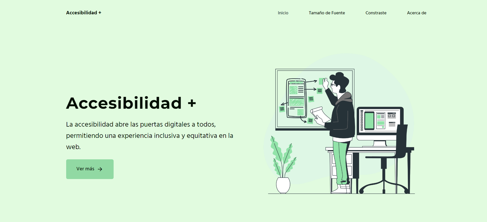
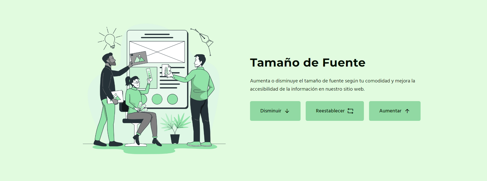
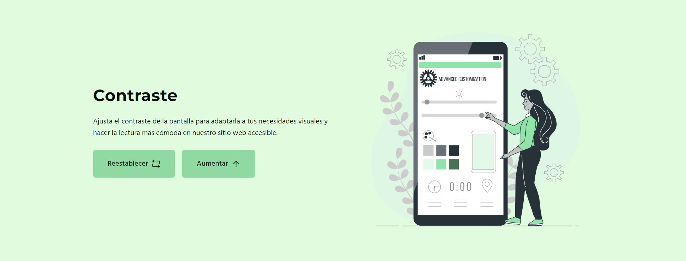
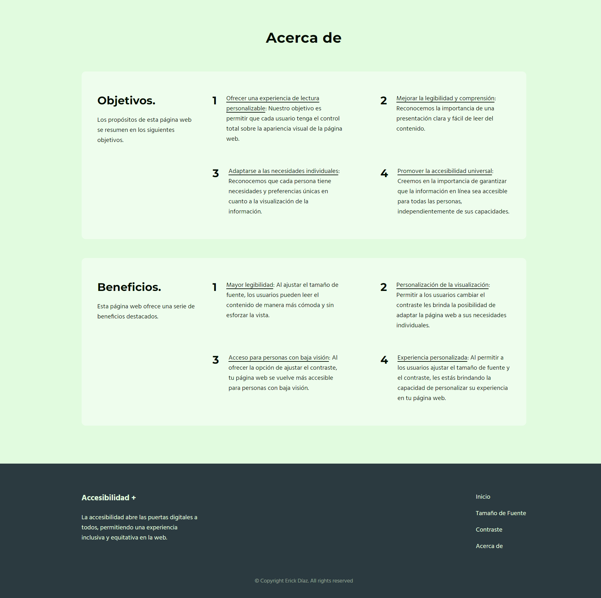

# Accesibilidad +
Es una página web que se enfoca en concientizar sobre la importancia de la accesibilidad web. Proporciona recursos y consejos para el diseño inclusivo de sitios web, promoviendo una experiencia accesible para todos, independientemente de sus habilidades. Destacando los beneficios de la inclusión, la página ofrece la posibilidad de ajustar el tamaño de letra y el contraste, asegurando una experiencia cómoda y personalizada para cada usuario.

## Tecnologías
Esta página web fue realizada con las siguientes tecnologías:
- HTML5
- CSS3
- JavaScript

## Secciones
Esta página web contiene 3 secciones: **Inicio**, **Tamaño de Fuente**, **Contraste** and **Acerca de**.

### Inicio
#### En esta sección encontrarás una breve descripción sobre la accesibilidad web, un botón que te dirige a la siguiente sección y una imagen.

### Tamaño de Fuente
#### En esta sección, te proporcionamos botones interactivos que te permiten ajustar el tamaño de letra según tus preferencias. Con solo un clic, podrás aumentar, disminuir o restablecer el tamaño del texto para que puedas disfrutar de una experiencia de lectura personalizada y cómoda.

### Contraste
#### En esta sección, te ofrecemos botones interactivos que te brindan la posibilidad de modificar el contraste de la página web. Con un simple clic, podrás ajustar el nivel de contraste para adaptarlo a tus necesidades visuales y lograr una experiencia de navegación más cómoda y accesible.

### Acerca de
#### En esta sección, hallarás detalles acerca de los propósitos y ventajas de una página web accesible, destinada a todos los usuarios. Al final, encontrarás el pie de página del sitio.

